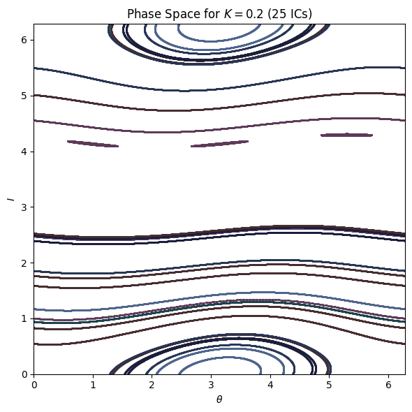
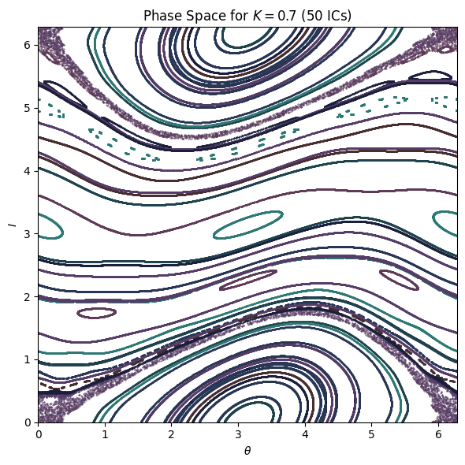
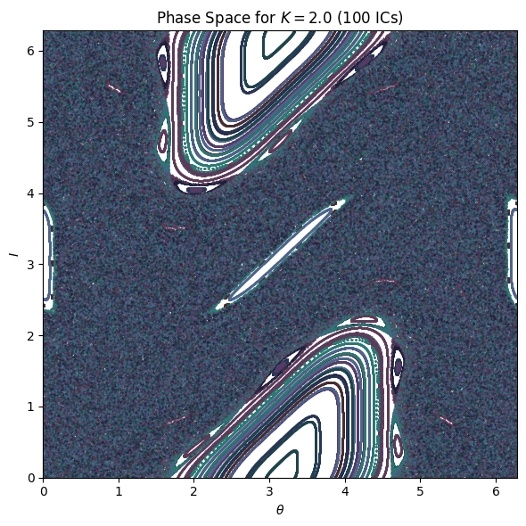
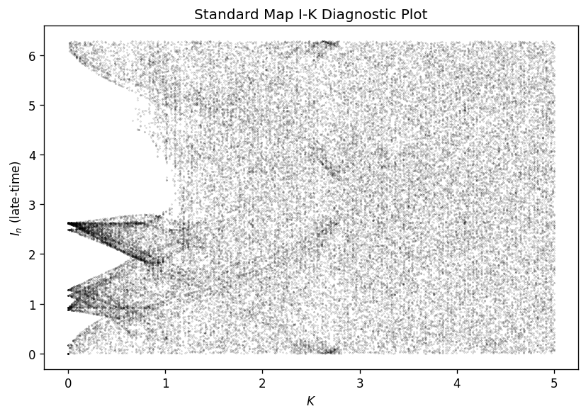
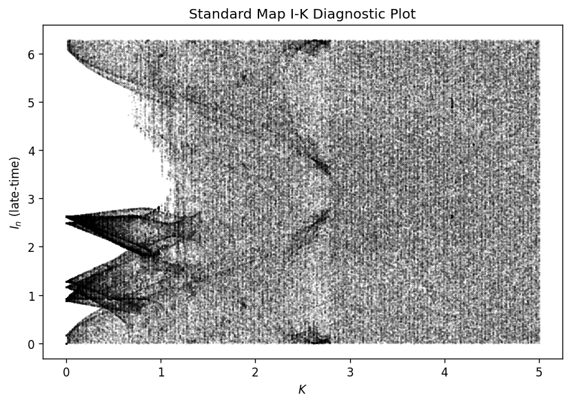

# Standard Map – Phase Space and K-Sweep Diagnostics

The Standard (Chirikov) Map is the iterated map:

> 

> $I_{n+1} = I_n + K\sin(\theta_n)$
> 

> 

> $\theta_{n+1} = \theta_n + I_{n+1} \; (\bmod 2\pi)$
> 

It is an **area-preserving**, discrete-time dynamical system defined on a **2D torus** $(\theta, I)$. Unlike dissipative maps (e.g., the logistic map), the Standard Map has **no attractors**.

This document contains the figures used to illustrate how phase-space structure evolves as the kick parameter $K$ varies.

---

## 1. Phase-Space Portraits

These plots show trajectories in $(\theta, I)$ space for a range of initial conditions.

---

### K = 0.2 — Quasi-Periodic Regime

**Key features:**
- Smooth, closed **invariant curves (KAM tori)**
- Both contractible and non-contractible tori are present
- Motion is **quasi-periodic**
- Minimal chaos; system nearly integrable

---

### K = 0.7 — Mixed Phase Space

**Key features:**
- Several KAM tori have broken into **resonance islands**
- Surrounding **island chains** and **stochastic layers** appear
- Coexistence of **quasi-periodic**, **periodic**, and **chaotic** orbits

---

### K = 2.0 — Larger K (Near Global Chaos)

**Key features:**
- Many invariant curves have been destroyed
- Wide **chaotic layers** merge into a **chaotic sea**
- Only small resonance islands persist
- Motion becomes diffusive in $I$ → **transport**

---

## 2. I–K Diagnostic Plots  
*(Illustrate structure breakdown; not true bifurcation diagrams)*

These plots show, for each $K$, the distribution of **late-time values** of $I_n$ across many initial conditions.

---

### Cleaner I–K Diagnostic (Subsampled)

**Interpretation:**
- Low $K$: horizontal bands = **KAM tori**
- Intermediate $K$: splitting into **resonance tongues**
- High $K$: cloud-like region = **global chaos**

---

### Dense I–K Diagnostic (Full Data)

**Interpretation:**
- Complete “texture” of the **area-preserving chaotic dynamics**
- Resonance structures and stochastic layers visible at moderate $K$
- Fully developed **chaotic sea** at larger $K$

---

## 3. Why This Is Not a Logistic Bifurcation Diagram

The logistic map is a **dissipative** system → trajectories collapse onto **attractors**, producing a clean branching structure described by

> 

> $x_{n+1} = r x_n (1 - x_n)$
> 

The Standard Map, by contrast, is **area-preserving**, and evolves via

> 

> $I_{n+1} = I_n + K\sin(\theta_n)$
> 

> 

> $\theta_{n+1} = \theta_n + I_{n+1}$
> 

Therefore:

- No collapse of trajectories  
- No attractors  
- No classical bifurcation structure  
- The I–K sweep is a **diagnostic**, not a true bifurcation diagram

---

## 4. Key Concepts

These are the essential ideas needed to interpret the figures.

- **Torus:** Phase space wraps around in both $\theta$ and $I$
- **Orbit / trajectory:** Sequence $(\theta_n, I_n)$
- **Area-preserving map:** No contraction or expansion; no attractors
- **Invariant curves (KAM tori):** Closed curves supporting quasi-periodic motion
- **Contractible / non-contractible tori:** Whether an invariant curve winds around the torus
- **Resonance islands:** Regions near periodic points with closed loops around them
- **Island chains:** Repeating resonance structures around stable periodic orbits
- **Stochastic (chaotic) layer:** Chaotic region near a broken invariant torus
- **Chaotic sea:** Large connected region of fully chaotic motion
- **Periodic orbit:** Orbit that repeats after $q$ steps
- **Quasi-periodic orbit:** Never repeats but stays on an invariant curve
- **Chaotic orbit:** Sensitive dependence; explores a region unpredictably
- **Transport:** Drift in the momentum-like coordinate $I$
- **Rotation number:** Average angular change per iteration; distinguishes rational (resonant) and irrational (non-resonant) behavior
- **Resonance tongues:** Features in the I–K plot associated with rational rotation numbers

---

## Appendix A — Glossary (Complete Term List)

This appendix lists all terminology identified while studying the Standard Map.  
Definitions are not included here; this section serves purely as a reference.

- area-preserving map  
- continuous map  
- discrete-time system  
- chaotic system  
- torus  
- orbit  
- trajectory  
- stroboscopic  
- invariant curves  
- KAM tori  
    - contractible tori  
    - non-contractible tori  
- separatrices  
- rotation number  
    - rational rotation number  
    - irrational rotation number  
- Devil’s staircase  
- resonance islands  
- periodic point  
- inner foliation  
- stochastic layer  
- chaotic layers  
- island chains  
- chaotic sea  
- cantorus  
- Cantor set  
- periodic orbit  
- quasi-periodic orbits  
- chaotic orbits  
- transport  
- dissipative map  
- attractor  
- fixed point  
- Feigenbaum cascade  

---
